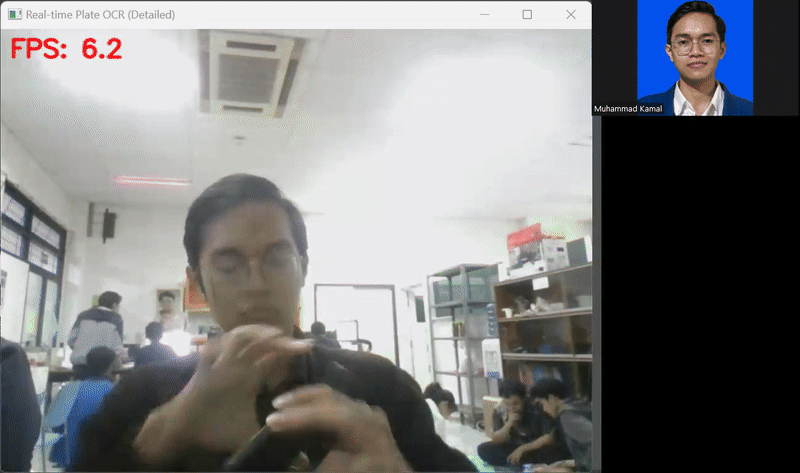

# DS-DA-Computer-Vision-For-Automatic-Number-Plate-Recognition
An end-to-end computer vision project for Automatic License Plate Recognition (ALPR). This repository contains the necessary code and resources to detect license plates in images and videos, and then extract the alphanumeric characters from the detected plates.

## Table of Contents
- [Project Overview](#project-overview)
- [Methodology](#methodology)
- [Results](#results)
- [References](#references)
- [Documentation](#documentation)

## Project Overview
This project implements an ALPR (Automatic License Plate Recognition) system for Indonesian license plates. It uses deep learning for plate detection and OCR for character recognition, and includes region identification based on the license plate code.

## Methodology
The main pipeline consists of the following steps:
1. **License Plate Detection**: Uses a YOLO-based model to detect license plates in images or video frames.
2. **Plate Cropping**: Detected plates are cropped from the frame for further processing.
3. **Optical Character Recognition (OCR)**: The cropped plate is passed to an OCR model (e.g., Fast Plate OCR) to extract the alphanumeric text.
4. **Region Identification**: The extracted text is parsed to identify the region/city of the plate using a detailed dictionary of Indonesian plate codes.
5. **Odd/Even Classification**: The last digit of the plate number is used to determine if the plate is odd (Ganjil) or even (Genap).
6. **Visualization**: Results are visualized with bounding boxes and text overlays on the original image or video frame.

The main script for real-time processing is in `src/main.py`. For step-by-step demonstration and experimentation, see the Jupyter notebook `src/flow_testing.ipynb`.

## Results
Example of the system in action:

More results can be found in the `result/` folder, including additional GIFs and videos.

## Documentation
A detailed explanation of the methods, pipeline, and results is available in the presentation PDF:
- [docs/Presentation_ID.pdf](docs/Presentation_ID.pdf)

## References
- YOLO: https://github.com/ultralytics/ultralytics
- Fast Plate OCR: https://github.com/sergiomsilva/alpr-unconstrained
- Indonesian License Plate Codes: [Wikipedia](https://id.wikipedia.org/wiki/Tanda_Nomor_Kendaraan_Bermotor)

---
For more details, see the code and notebooks in the `src/` folder.
